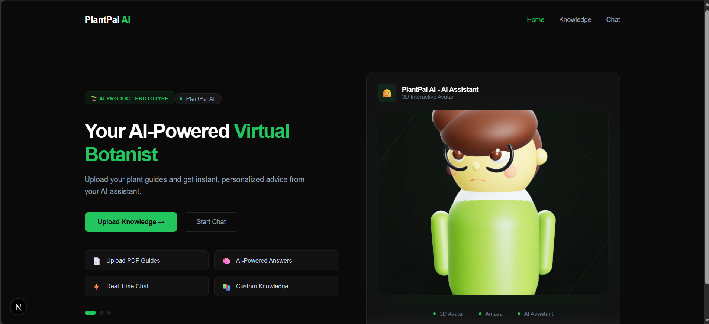
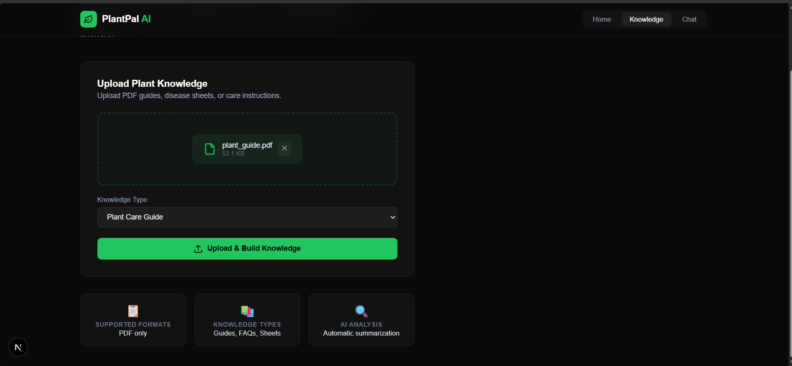
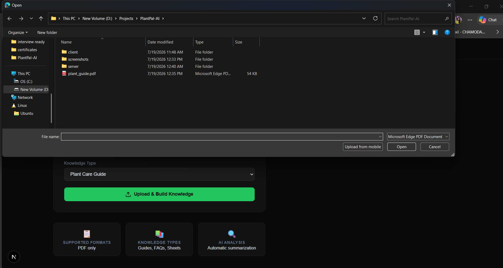
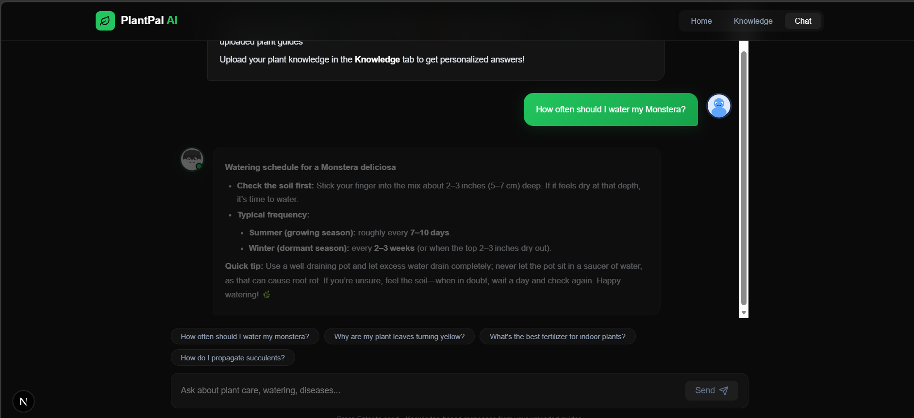
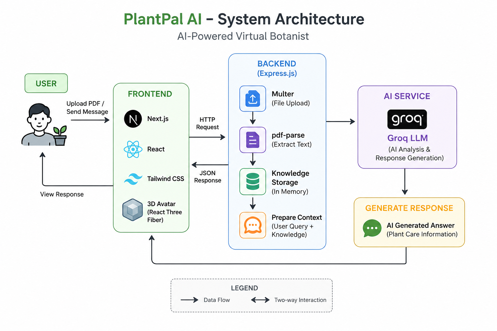

# 🌿 PlantPal AI – AI-Powered Virtual Botanist

> **Your Intelligent Home Botanist** – An AI-powered plant care assistant that helps users understand and care for their plants using uploaded PDF knowledge and natural conversations through an interactive 3D avatar.

---

# 🚀 Overview

PlantPal AI is a full-stack AI prototype developed for the **AI Product Prototype Challenge**.

The application allows users to upload plant-care documents in PDF format, extract useful knowledge, and interact with an AI-powered virtual botanist through a modern chat interface. The project combines document processing, AI-powered responses, and an engaging 3D avatar experience to make plant care simple and interactive.

---

# ✨ Features

* 🌱 AI-powered plant care assistant
* 🤖 Interactive 3D avatar built with React Three Fiber
* 👀 Mouse tracking and blinking animations
* 💬 Natural language chat interface
* 📄 Upload plant-care PDF documents
* 📚 AI analyzes uploaded knowledge
* ⚡ Fast document processing
* 🎨 Modern responsive UI
* 📱 Mobile-friendly interface
* 🔒 Clean REST API architecture

---

# 🛠 Tech Stack

## Frontend

* Next.js 15
* React 19
* TypeScript
* Tailwind CSS
* React Three Fiber
* Drei
* Framer Motion
* Lucide React

## Backend

* Node.js
* Express.js
* TypeScript
* Multer
* pdf-parse
* Groq SDK

---

# 🏗 Project Structure

```text
PlantPal-AI
│
├── client
│   ├── app
│   ├── components
│   ├── hooks
│   ├── lib
│   ├── public
│   └── package.json
│
├── server
│   ├── src
│   │   ├── controllers
│   │   ├── routes
│   │   ├── services
│   │   ├── utils
│   │   └── index.ts
│   │
│   ├── uploads
│   ├── package.json
│   └── .env.example
│
├── README.md
└── .gitignore
```

---

# 🔄 Application Workflow

```text
Upload Plant PDF
        │
        ▼
Next.js Frontend
        │
        ▼
Express Backend
        │
        ▼
Multer Upload
        │
        ▼
pdf-parse
        │
        ▼
Groq AI Analysis
        │
        ▼
Generate Response
        │
        ▼
Chat Interface
```

---

# 📦 Prerequisites

* Node.js (v18 or higher)
* npm
* Groq API Key

Create a free Groq API key from:

https://console.groq.com/keys

---

# ⚙️ Installation

## Clone the Repository

```bash
git clone https://github.com/SandaniChamoda/PlantPal-AI.git

cd PlantPal-AI
```

---

## Backend Setup

```bash
cd server

npm install
```

Create a `.env` file:

```env
PORT=5000

GROQ_API_KEY=_groq_api_key_
```

Run the backend:

```bash
npm run dev
```

Backend runs on:

```
http://localhost:5000
```

---

## Frontend Setup

Open another terminal.

```bash
cd client

npm install
```

Create `.env.local`

```env
NEXT_PUBLIC_API_URL=http://localhost:5000
```

Run:

```bash
npm run dev
```

Frontend runs on

```
http://localhost:3000
```

---

# 🧪 Usage

### 1. Upload Knowledge

* Open the Upload page.
* Select a plant-care PDF.
* The backend extracts the document text.
* Groq AI processes the uploaded knowledge.

### 2. Chat

* Open the Chat page.
* Ask questions about your plants.
* The assistant responds using the uploaded knowledge.

### 3. Avatar Interaction

* Move the mouse.
* Watch the avatar follow the cursor.
* Natural blinking and interaction provide a more engaging experience.

---

# 📡 API Endpoints

| Method | Endpoint      | Description           |
| ------ | ------------- | --------------------- |
| POST   | `/api/upload` | Upload a PDF document |
| POST   | `/api/chat`   | Send a chat message   |

---

# ✅ Implemented Features

* ✔ Next.js Frontend
* ✔ Express Backend
* ✔ PDF Upload
* ✔ PDF Text Extraction
* ✔ Groq AI Integration
* ✔ Interactive Chat
* ✔ 3D Avatar
* ✔ Responsive Design
* ✔ REST API
* ✔ TypeScript
* ✔ Error Handling

---


# 📸 Screenshots

## 🏠 Landing Page


## 📄 Upload Knowledge


## 📖 Browse PDFs


## 💬 Chat Interface


## 🌱 AI Response


## 🏛️ System Architecture

```

---

# 🚀 Deployment

## Frontend

Deploy using:

* Vercel

## Backend

Deploy using:

* Render
* Railway

Remember to configure:

```
NEXT_PUBLIC_API_URL
```

and

```
GROQ_API_KEY
```

---

# ⚠ Current Limitations

* Currently supports PDF documents only.
* AI responses depend on the availability of the Groq API.
* Uploaded files are stored temporarily.

---

# 🔮 Future Improvements

* User Authentication
* Chat History
* Vector Database Integration
* Semantic Search
* Multiple PDF Upload
* Voice Assistant
* Plant Disease Detection
* Plant Image Recognition
* Cloud Storage
* Docker Deployment

---

# 🤝 Contributing

This project was developed as a prototype for the **AI Product Prototype Challenge**.

Suggestions and improvements are always welcome.

---

# 📄 License

This project is intended for educational and demonstration purposes.

---

# 🙏 Acknowledgements

* Groq
* Next.js
* React
* React Three Fiber
* Tailwind CSS
* Express.js
* pdf-parse
* Multer

---

## ❤️ Built for the AI Product Prototype Challenge

Developed with passion to demonstrate how AI can make plant care more accessible, interactive, and intelligent.
